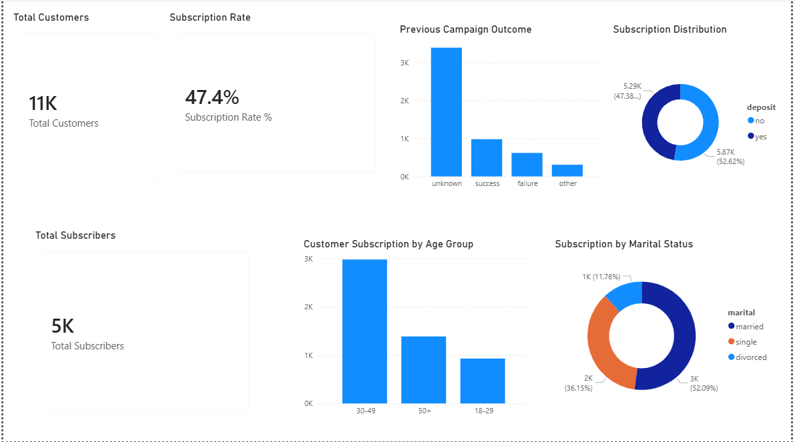

# Bank Marketing Analysis

## Project Overview
This project analyzes a bank marketing campaign dataset to understand customer behavior and identify factors that influenced subscription success.

The project includes data cleaning in Python and dashboard visualization in Power BI.

---

## Tools Used
- Python
- Pandas
- Power BI
- CSV Dataset

---

## Project Workflow
1. Loaded raw bank marketing data
2. Cleaned and transformed the dataset using Python
3. Created age groups and subscription indicators
4. Loaded the cleaned data into Power BI
5. Built an interactive dashboard to analyze campaign performance

---

## Dashboard Insights
- The campaign achieved a 47.4% subscription rate
- Customers aged 30–49 had the highest number of subscriptions
- Married customers represented the largest subscription group
- Previous successful campaign outcomes increased future subscription success

---

## Files Included
- `bank.py` → Python data cleaning script
- `clean_bank_data.csv` → cleaned dataset
- `Bank Marketing Analysis.pbix` → Power BI dashboard
- `dashboard_screenshot.PNG` → dashboard preview
- `campaign_insights.txt` → business questions and answers

---

## Dashboard Preview

